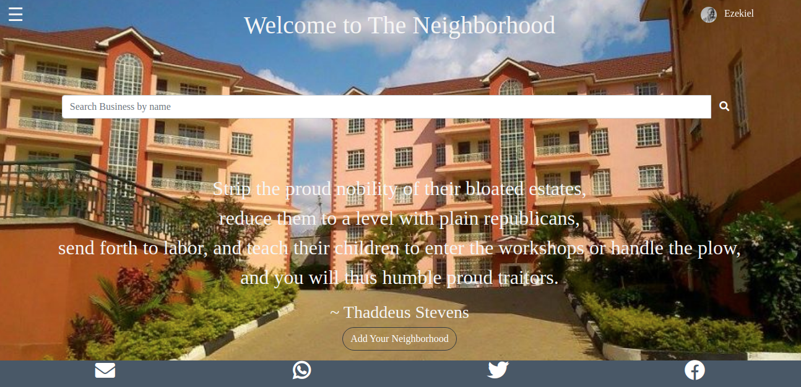
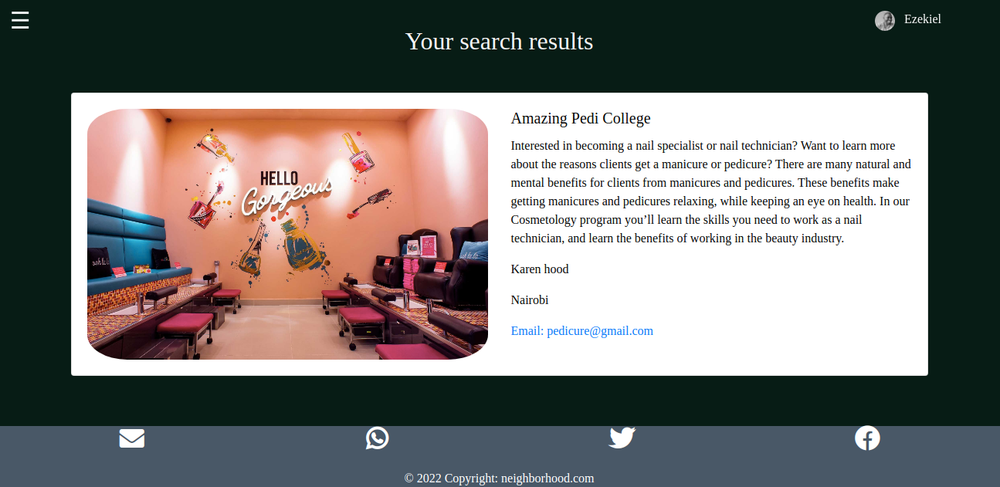
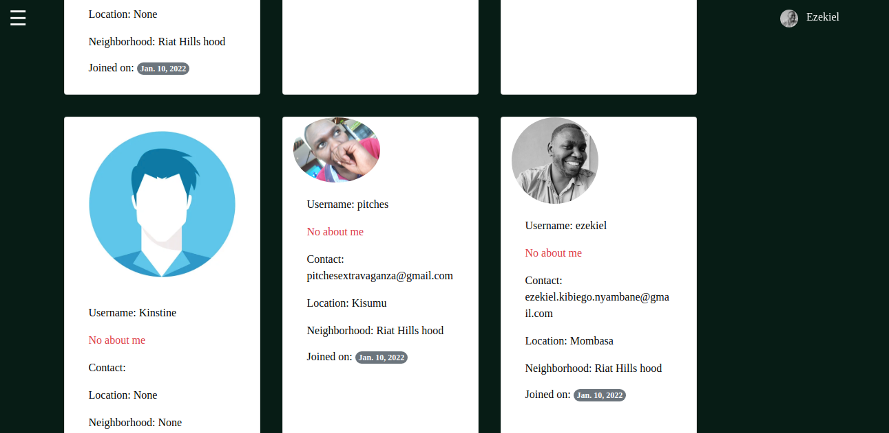

# The_Neighborhood

### 7th Jan. 2022

## Author  
  
[Ezekiel Kibiego](https://github.com/ezekielkibiego)  
  
# Description  

This is a Web Application that allows users, after signining in, join a neighborhood as well as add a neghborhood, add businesses and update posts on the occurences of different neighborhoods.

##  Live Link  
 
https://theneighborhoods.herokuapp.com/  
## Screenshots 

### Landing Page

### Register Form

### Create Profile Form

### Login Form

### Home Page

### Navbar Page

### Search Hoods Page

### User Profile Page

### Update Profile Form

